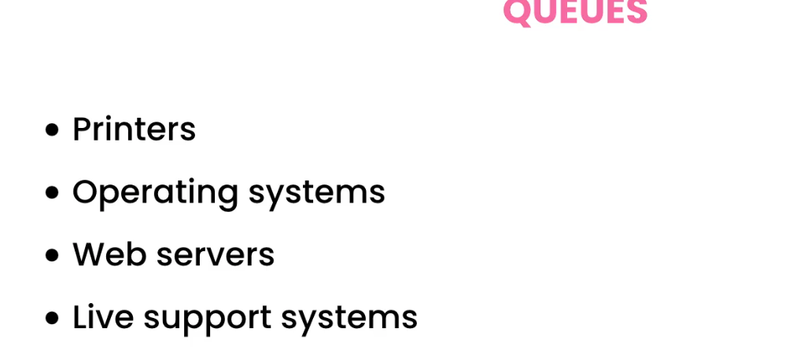
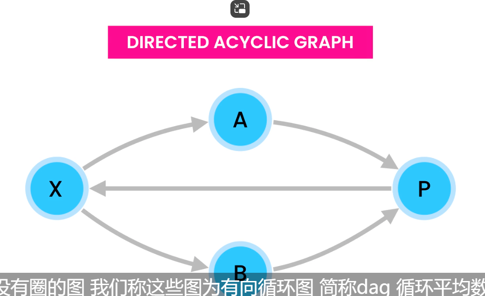

#

# 1

线性结构：array stack linklist queue hashtable set collection!

hashtable is deterministic 1 to 1
[img_2.png](img_2.png)

hashtable allow null key and value

字符串的第一个不重复字符

hashTable的处理一个是chain，一个是open address
hashTable存储的是键值对
## open address
linear prob
1. 链地址法 (Separate Chaining)
   原理: 当多个键映射到同一个哈希桶时，在这个桶里存储一个链表（或者其他数据结构，如平衡树）。如果发生冲突，冲突的键值对就被添加到该链表中。
   优点: 实现简单，处理冲突的能力较强；适用于频繁发生冲突的场景。
   缺点: 当链表长度增加时，查找效率会降低到 O(n)。
   Java 示例: HashMap 和 Hashtable 采用链地址法。对于 HashMap，当链表长度超过一定阈值时（默认是8），链表会自动转换成红黑树，从而优化性能。
2. 开放地址法 (Open Addressing)
   原理: 如果发生哈希冲突，尝试在哈希表的其他空闲位置存放冲突的键值对。常见的开放地址法包括：
   线性探测 (Linear Probing): 在冲突时依次检查下一个位置，直到找到空闲位置。
   二次探测 (Quadratic Probing): 使用平方形式跳跃检查空闲位置。
   双重哈希 (Double Hashing): 使用另一个哈希函数来计算新的位置。
   优点: 不需要额外的存储空间。
   缺点: 当表接近满时，探测时间变长，插入和查找的性能会下降。
3. 再哈希 (Rehashing)
   原理: 当哈希表变得过满时，动态地扩大哈希表的容量，并重新计算每个键的哈希值。再哈希可以减少冲突的发生。
   优点: 扩容后冲突减少，查找效率提高。
   缺点: 再哈希过程比较耗时，因为需要重新计算和迁移所有元素的位置。Java 的 HashMap 在负载因子超过 0.75 时会自动进行再哈希。
4. 扩展链地址法 (Coalesced Hashing)
   原理: 结合链地址法和开放地址法的优势，使用开放地址法来找到冲突元素的空位，同时链表的指针指向新的位置，避免链表长度过长。
   优点: 减少了链表长度的问题，同时优化了空间使用。
   缺点: 实现复杂，容易出现长链。
5. 哈希函数的优化
   原理: 设计一个好的哈希函数可以减少冲突的发生。好的哈希函数应当能将输入数据均匀分布到哈希表中，减少“热点”区域。
   常见的哈希函数技术: 例如使用乘法哈希、模哈希、位操作等。
6. 这个公式代表双重哈希法（Double Hashing）中第二个哈希函数的定义。在双重哈希中，第二个哈希函数用于避免哈希冲突。

公式解释：
hash2(key) = prime - (key % prime)

key % prime: 这是取键 key 和一个质数 prime 的模，确保返回一个介于 0 和 prime-1 之间的值。
prime - (key % prime): 通过减去 key % prime，确保返回的步长不会是 0，从而为探测过程提供一个非零的步长。
为什么有效：
避免线性探测的问题： 在开放地址法的线性探测中，步长是固定的，这会导致"初始冲突"的键可能会映射到相邻的存储单元，从而引发聚集现象（clustering），降低性能。双重哈希通过不同的哈希函数生成步长，可以有效减少这种聚集现象，避免线性探测时频繁出现的冲突。

质数的选择： 选择一个质数 prime 作为第二个哈希函数的模数非常重要。质数能确保计算出来的步长更加均匀分布，从而避免重复使用相同的槽位。质数有助于使哈希函数生成更多样化的步长，使探测路径更随机化。

避免零步长： 通过使用 prime - (key % prime) 而不是直接使用 key % prime，确保步长不为 0。如果步长为 0，哈希表中的位置永远不会改变，这将导致冲突无法解决。而这个公式保证了步长至少为 1，从而确保每次冲突时都可以继续探测。****


## Tree 
反转树的关键是如何遍历，BFS and DFS
BFS 数据结构是采用队列进行遍历
DFS 是采用递归
TRee的depth和height是不同的
depth是某个node得到根的距离
height 与深度的想反，取最长
root's height is tree's height
```java
    private int height(Node node){
            if(node == null) return -1;
            if (node.leftChild ==null&&node.rightChild==null) return 0;
            return Math.max(height(node.leftChild), height(node.rightChild)) + 1;
    }
```
```java
    private int min(Node node){
   if(node == null) return Integer.MAX_VALUE;
   if (node.leftChild ==null&&node.rightChild==null) return node.value;
   return Math.min(Math.min(min(node.leftChild), min(node.rightChild)),node.value);
}
```
```java
    private void nodesAtDepth(Node node, int depth,ArrayList<Integer> list){
            if(depth == 0)
            {
                list.add(node.value);
            }
            else {
                if (node.leftChild!=null){
                    nodesAtDepth(node.leftChild, depth-1,list);
                }
                if (node.rightChild!=null){
                    nodesAtDepth(node.rightChild, depth-1,list);
                }
            }
    }
```
有序的水平遍历需要队列或者上诉code

## AVLTrees


数的平衡需要rotation


左旋转是变为左结点，右旋是右


## Heap is tree
with full and left by right
HEAP PROPERTY：节点数据同时大于左右子树中的结点

Heap往往用array实现，因为它没有空腔
关键是粒子的交换保持
```java
    private void bubbleUp() {
   int index = count - 1;
   while (index>0&&heap[index] > heap[parent(index)]) {
      swap(index, parent(index));
      index = parent(index);
   }
}
```
堆需要实现两个bubble up bubble down
```java
    private void bubbleDown() {
        var index = 0;
        while(!isValidParent(index)&&index<count){
            var largeChildIndex = largeChildIndex(index);
            swap(largeChildIndex,index);
            index = largeChildIndex;
        }
    }
private void bubbleUp() {
   int index = count - 1;
   while (index>0&&heap[index] > heap[parent(index)]) {
      swap(index, parent(index));
      index = parent(index);
   }
}
```
通过remove实现降序排序


Heapify算法 将数组转变成为堆
```java
    public static void heapify(int[] arr) {
        for (int i = 0; i<arr.length/2-1; i--) {
            heapify(arr,arr.length/2-1-i);
        }
    }
    private static void heapify(int[] arr, int index) {
        var largeIndex = index;
        var leftIndex = index*2+1;
        var rightIndex = index*2+2;
        if (leftIndex < arr.length && arr[leftIndex] > arr[largeIndex])
            largeIndex = leftIndex;
        if (rightIndex < arr.length && arr[rightIndex] > arr[largeIndex])
            largeIndex = rightIndex;
        if (largeIndex == index) return;
        swap(arr,index,largeIndex);
        heapify(arr,largeIndex);
    }
    private static void swap(int[] arr, int i, int j) {
        int temp = arr[i];
        arr[i] = arr[j];
        arr[j] = temp;
    }
```
第一个叶子结点是n/2
# tries


特别适合字符串的存储和检索

```java
    private class Node {
        char value;
        HashMap<Character, Node> children = new HashMap<>();
        Boolean isEndOfWord = false;
        Node(char value) {
            this.value = value;
        }
        Node() {}

        @Override
        public String toString() {
            return "Node{" +
                    "value=" + value +
                    '}';
        }
    }
```
使用hashtable处理问题

递归调用导致的post traverse and pre-traverse
只是输入点的不同
```java
    public void traverse(Node node) {

            if(node.isEndOfWord) {
                return;
            }
            for(var child : node.children.values()) {
                traverse(child);
            }
        System.out.print(node.value + " ");
    }
```
但是在tries中，我们把根节点置为null，在各种操作的时候要特别注意空指针异常

# Graph

邻接表，先用hashtable定位给定点在表中的位置
space=V+E


广度队列 深度栈
判断是否出来既要看vistited 也要看存储的数据结构
```java

    public void depthFirstSearchIterative(String label) {
        if (!nodes.containsKey(label)) return;
        var node =  nodes.get(label);
        Stack<Node> stack = new Stack<>();
        Set<String> visited = new HashSet<>();
        stack.push(node);

        while (!stack.empty()) {
            Node top = stack.pop();
            visited.add(top.label);
            System.out.println(top.label);
            for (var edge : adjacency.get(top)) {
                if (!visited.contains(edge.label)){
                    stack.push(edge);
                }
            }

        }

    }
```
Topological Sorting 
需要注意的我们在处理的时候还要看点是否存在stack中

为了正确处理图的路径

### Detecting cycle graph


```java
public Boolean isCycle(){
        HashSet<String> visited = new HashSet<>();
        Stack<String> visiting = new Stack<>();
        HashSet<String> all = new HashSet<>(nodes.keySet());
        for(var label :all) {
            Stack<String> stack = new Stack<>();
            stack.push(label);
            visiting.add(label);
            while (!stack.empty()) {
                var current = stack.peek();
                Boolean hasUnvisitedNeighbors = false;
                for (var neighbor : adjacency.get(nodes.get(current))) {
                    if (visited.contains(neighbor.label)) {continue;}
                    if (visiting.contains(neighbor.label)){return true;}
                    visiting.add(neighbor.label);
                    stack.push(neighbor.label);
                    hasUnvisitedNeighbors = true;
                    break;
                }
                if(!hasUnvisitedNeighbors) {
                    stack.pop();
                    visiting.remove(current);
                    visited.add(current);
                }
            }
        }
        return false;
    }
```
不采用递归解决
多用迭代器


如果存在那么就一定存在，如果不存在，但是可能存在


## Dijkstra

确定处理问题所需要的信息
要用到优先队列
```java
    public int dijkstra(String from, String to) {
        HashSet<Node> visited = new HashSet<>();
        HashMap<Node,Integer> distances = new HashMap<>();
        HashMap<Node,Node> previous = new HashMap<>();
        PriorityQueue<Node> pq = new PriorityQueue<>(Comparator.comparingInt(distances::get));
        var current = nodes.get(from);
        previous.put(current,current);
        for (var node:nodes.values())
        {
            distances.put(node, Integer.MAX_VALUE);
        }
        distances.replace(current, 0);
        pq.add(current);
        while (!pq.isEmpty()) {
            current = pq.poll();
            visited.add(current);
            var list =adjacencyList.get(current);
            for (var item : list) {
                if (visited.contains(item.to)) continue;
                Integer newDistance = distances.get(current)+item.weight;
                if (newDistance < distances.get(item.to)) {
                    distances.replace(item.to, newDistance);
                    previous.put(item.to, current);
                }
                pq.add(item.to);
            }
        }
        var toNode = nodes.get(to);
        var previousNode = previous.get(toNode);
        System.out.println(distances.get(nodes.get(to)));
        System.out.println(toNode.label+"");
        while(toNode!=previousNode){
            System.out.println(previousNode.label+"");
            var temp = previousNode;
            previousNode = previous.get(previousNode);
            toNode = temp;

        }
        return distances.get(nodes.get(to));
    }

```


